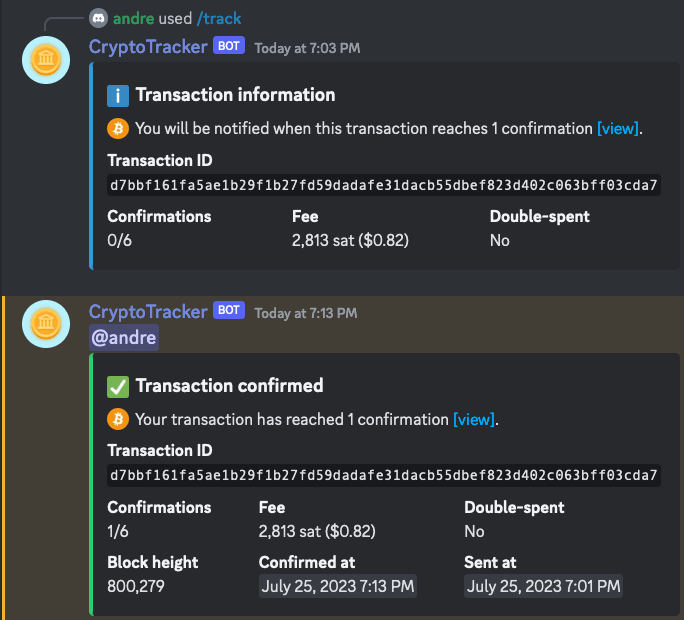

# CryptoTracker

[](https://discord.gg/dCNthcSrkS)
[](https://discord.com/api/oauth2/authorize?client_id=1132724830135922688&permissions=277025508352&scope=bot%20applications.commands)


🤖 A Discord bot that notifies users when their cryptocurrency transaction has confirmed.

## Features

- Pings you when a transaction reaches a specified number of confirmations
- Support for Bitcoin (BTC), Ethereum (ETH), and Litecoin (LTC)
- Usage of Discord interactions (application commands)
- Easy setup and installation



## Run Locally

Clone the project

```bash
  git clone https://github.com/aelew/cryptotracker.git
```

Go to the project directory

```bash
  cd cryptotracker
```

Install dependencies

```bash
  pip install -r requirements.txt
```

Set environment variables

```
  To run this project, you will need to set the required environment variables.
  These can be found in the `.env.example` file.
```

Start the bot

```bash
  py main.py
```

## License

[MIT](https://choosealicense.com/licenses/mit/)
